**The University of Melbourne**
# COMP30019 – Graphics and Interaction

# Project-2 (Layers of dreams)

[Demo Video Here](https://www.youtube.com/watch?v=wgohn5IbHag)

<p align="center">
  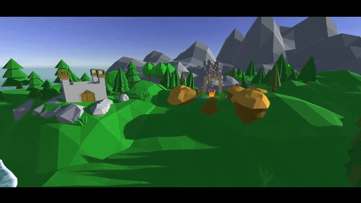
</p>


## Table of contents
- [Project-2 README](#project-2-readme)
  - [Explanation of the game](#explanation-of-the-game)
  - [How to use it](#how-to-use-it)
  - [How you modelled objects and entities](#how-you-modelled-objects-and-entities)
  - [How Shaders Works](#how-shaders-works)
  - [Evaluation and Changes](#evaluation-and-changes)
  - [Code Attribution](#code-attribution)
  - [Contribution](#contribution)
  - [Our Reflections](#our-reflections)


## Explanation of the game
The name of our game is layers of dreams.This is a third-person shooter game.  The game mainly talks about the fantastic imaginations of  a leg-broken girl.  Her diary records her experiences and emotions. The imagination turns her experience in the day into different dreams at night. In the dream , she is free to run , free to jump , free to explore the world.

The dream made up for her regret that she could not exercise during the day. At the end of the game, the girl recovered.And now is her time to explore the world. 
In this game, the player will take control, to go on the journey of exploring with the girl in her dreams. In these dreams, enemies will attack the girl, making the exploration a nightmare of getting hurt and dying. The player is supposed to help, eliminating all these enemies in each dream.


	
## How to use it

### Interactions
The interactions and key bindings of the game is as follows:
1.	Use W A S D to move around
2.	Move the mouse to move the camera perspective
3.	Use spacebar to jump
4.	Click, or hold left mouse button to attack, which is a ranged attack, shooting light bullets of energy
5.	Press R for super skill “Scatter the Weak”, which will produce a shock wave, pushing close-by enemies away from the player. This skill has a cool down of 8 seconds.
6.	To use items, press 1 2 3 4 5 (not the numpads though)
7.	To proceed to the next level, kill all enemies, and look for the portal spawned. Once the player is in the portal, press T to proceed to the next level.
8.	When the player is inside the hospital room, press Tab to bring up the diary
9.	Press ESC at any time to bring up the menu and pause the game. Left click mouse button to interact with the menu

### User Interface

<p align="center">
  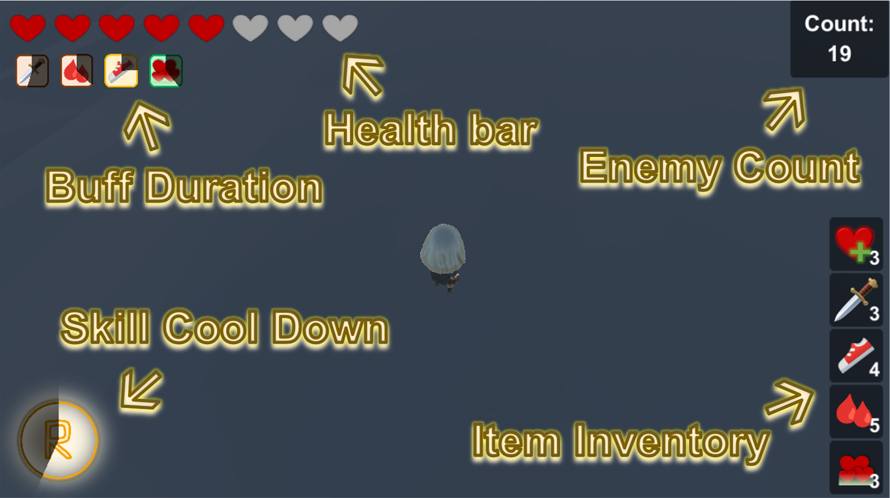
</p>

As shown in the picture above, the main information displayed on the UI is as follows:
1.	Health bar—player’s current health, on top left corner
2.	Buff duration countdown—for all buffs that are actively applied on the player, there will be a countdown icon to show the remaining duration of the buff effect, right below the health bar
3.	Enemy count—how many enemies are remaining in the current level to be eliminated, on the top right corner
4.	Inventory of items—how many items do the player currently own, on the bottom right corner
5.	Skill cool down—status of cool down of the super skill of the player, on the bottom left corner

## How you modelled objects and entities

### Enemy 

During the production of our enemy, we found it was quite interesting and challenging.  At the very first stage, we wish we only have two basic types of enemies Melee and Ranged. Therefore, we searched information about other game design thoughts according to how games perform “Attack” logic on the enemies.

Then, we realised there are two key words: Search Range and Attack Range. 


<p align="center">
  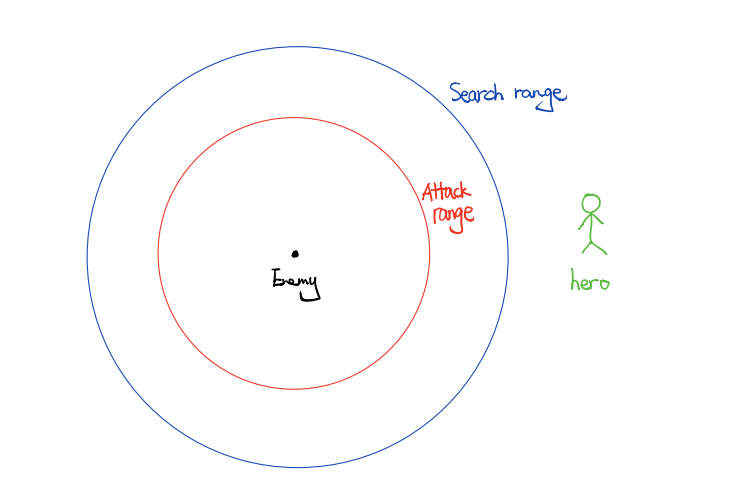
</p>

As the abstract drawing above (drawn by Hatch), for enemies they have 2 key attributes: Attack Range and Search Range. How do they work? As we check every second in the game whether the hero is in the Search Range of our enemies. Once the hero is in the Search Range, the “Move” function will be triggered, then starting to move towards the hero, until the hero is in the Attack Range of our enemies. Once the condition is satisfied the “Attack” function will be triggered, then our enemies will follow the hero and attack. If the hero runs away from the Search Range of our enemies, our enemy will stop chasing and being idle (waiting for the hero to fall into trap again). 

Then we just adjust the Search Range and Attack Range for different enemies for Melee and Ranged. For ranged enemies, we attach a particle system for them, whenever they attack, they will instantiate a projectile (particle system) towards our hero.

For what is interesting, we also add a suicide enemy, which has nearly the same attribute as our Melee enemies, but it has 2 attack damage and it will kill itself when attacking the hero. With a great explosion particle system, it looks really cool. 

Last but not least, there is a special attacking logic—not dealing damage, but applying a debuff to the player. For example, spiders will apply a poisoned debuff, which will continuously reduce the player’s health within a short period of time.

<p align="center">
  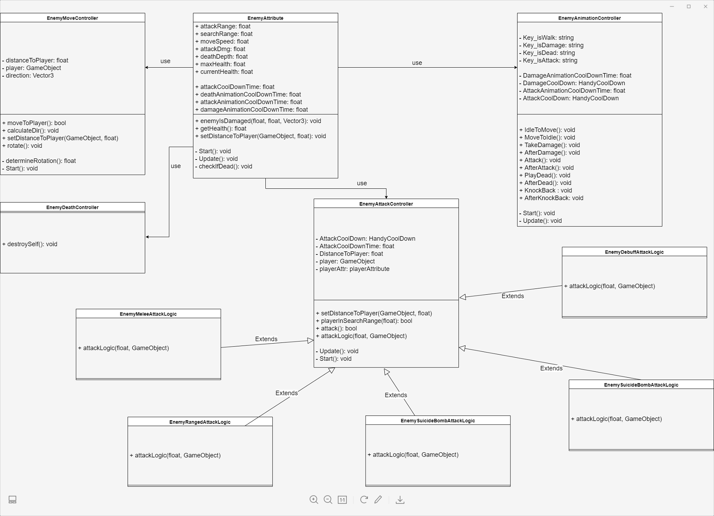
</p>

### Main Character 
Our main character, named Hero, has scripts to move using WSAD, to jump using Space KEY, to rotate using mouse positions. 

<p align="center">
  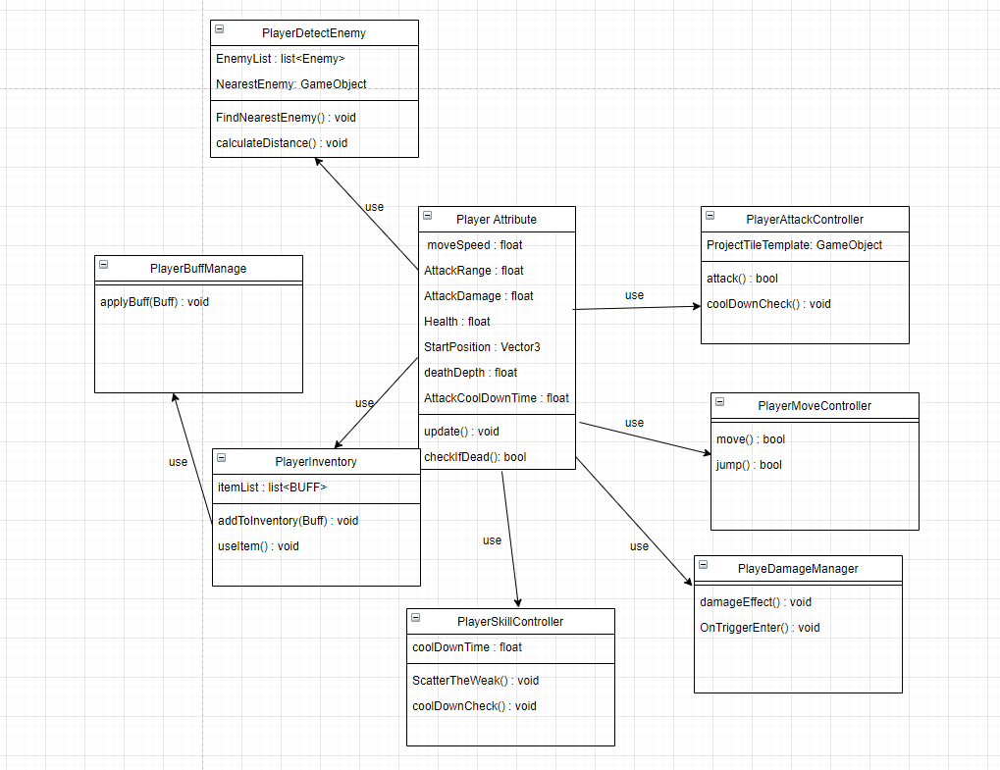
</p>

The above is a uml for our hero. It has a main script, player attribute, which stores all attributes inside, and it uses other script components to do player functions. 
 
1.	Attack controller will handle how the hero attacks, and how fast it can attack. 
2.	Move controller will handle how the hero moves and rotates.
3.	Damage Manager will handle when the hero is damaged by enemies, and will produce hitting effects and sound.
4.	Player Skill Controller will handle the skills the hero has.
5.	Player Inventory will keep an eye on how many buffs a player has collected, and used.
6.	Player Buff will handle how all Buff works.
7.	Player Detect Enemy will keep an eye on all enemy, and calculate to find the nearest enemy to attack.


### Boss 
Boss basically is the stronger version of enemies. It also has all the scripts that other enemies have. But have a different attack logic.

The Golem Boss has nothing special, its body is just a melee enemy, but we have added another object to its body called stone shield, it will rotate around the Golem boss and damage Hero when the shield hits the Hero. 

The Slime Boss has a special attack logic inherited from the enemy EnemyAttackController that he can fire three slime enemies to his front when he attacks.
The Spider Boss has an attack logic inherited from EnemyMeleeAttackLogic, therefore it is also a melee enemy, but with a little extra functionality. When it hits the player, it slows and poisons Hero, which adds two debuffs to Hero. Additionally it has a special script to jump up to a high place and finds heros position and jump down, so he can reach the Hero.

### Items
Items are just buffs, but the trigger of applying it to the player is in the hands of the player.
Items are placed on the ground for the player to pick up. When an item is picked up, the quantity of the item in the inventory will increase by 1. 

The player will be able to use an item if the quantity of the item in its inventory is more than 1. Using an item will apply a buff to the player. Upon the application of buff, there will be 3 effects applied to the player—immediate, continuous and after effect. Immediate effect is applied on the player immediately; continuous effect is applied on the player every second; after effect is applied on the player when the duration of the item has expired. 

It is not necessary for a buff to have all three effects defined. Thus, buff is a just combination of effects. For example, a simple health recovery has an immediate effect, leaving the other two blank, while health regeneration (called recovery blessing in our game) is a continuous effect only. 

Buff is designed originally to suit for varying attacks, and damage calculations as well. Unfortunately, time is running short and the plan is disregarded. But this is the reason why there is a class called logic buff, but no class is inheriting from it. 

### Game Events

A lot of the functions in the game are event-driven. It was first introduced into the design because of issues with animation controllers. Later, UI and transitions between levels are based on events as well. 

Game event is instantiated as a singleton. There is only one object and script for game events, and all functions have access to it, in other words, any function in any script can register as a listener to any event listed in the game event script.

Since the player’s scripts have undergone a lot of changes, it is beneficial to use a singleton and event driven approach, just to decouple classes and functions. 

Though almost half of the events are for UI scripts, the others are really useful. For example, if the player has no health, it triggers an event called PlayerDeathEnter(). This event has multiple listeners, including LoadLevelCountDown() that loads the current scene again after a countdown, PlayDead() that plays the death animation. It is much more convenient, instead of having the player’s script to hold onto all references, and call so many other functions in other scripts.

### UI 
The UI is composed of numerous Unity Canvas objects. They could be classified by their render mode: Camera Overlay and World Space.

Most of the canvas objects are rendered in camera overlay mode, scaled with screen size, so that it would appear on screen, on top of everything else. They provide critical information to the player, including its own status and game progress. Menus are also rendered in this mode. The rest is rendered at World Space, so that they are on top of objects, in world space, but looking at the camera.

#### Camera Overlay—In-Game UI

Some of these canvas objects give information about players—player’s current health, buffs, inventory, skills. In the project, they are all called in-game UI. 

Player’s health bar is special, because it is not actual objects of images or sprites. The health bar is drawn on the screen directly on the screen with the function GUI.DrawTexture(). So it does not matter with render mode it is, it always appears on top. We have adopted the design of presenting health as hearts from the game The Binding of Issac.

Players buff icons are prefabs of radial slider, of which fill amount is updated by script with respective to time. The prefab icon is instantiated as a child to the PlayerBuffDisplay object, only when the buff is applied on a player. The fill amount increases as the duration of the effect reduces. When the fill amount reached 1–meaning the icon is covered in black—the icon will destroy itself. In cases where there are more than 1 icon, their positions will be realigned on update.

Inventory is a vertical bar in order to make space for the boss health bar. It is composed of a black background block, a sprite—the icon of the item, and a text object. The text is updated with the player inventory, so that when the player picks up an item, the quantity goes up, the text changes as well to give feedback of picking up an item.

Skill icons are designed with the mindset that there will be multiple skills for the player to use. Thus, the icons do not need to be instantiated. Most of them are disabled. The only one that is now in use is the icon for super skill. It is a radial slider. Whenever the skill is used, the fill amount turns to 1, covering the icon in black. On every update, if the fill amount is not 0, it decreases. 

If there is a boss in the scene, the boss health bar will be enabled, using GameObject.SetActive(true) in script. The boss health bar is basically composed of 6 sliders, and a black background. The health bar is a complicated (triple) version of the enemy health bar, which will be explained in the latter section. 

<p align="center">
  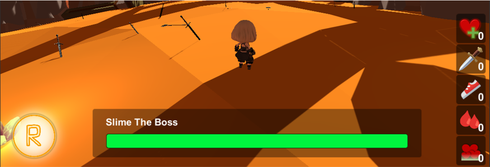
</p>

#### Camera Overlay—Pause Menu, Instruction, Diary, Death Prompt

<p align="center">
  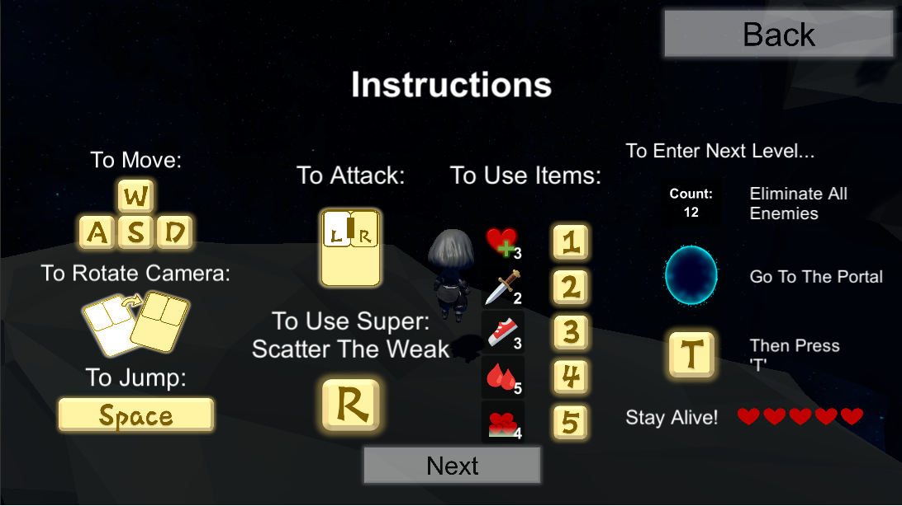
</p>

The player is able to press Esc at any time to bring up the pause menu, in which the player can choose to resume, read instructions, or quit the game. The instruction is canvas objects--text and images of sprites--that provides information about the key bindings and the game objective. Diary is the UI in the rooms, providing details of the plot. Death prompt is a canvas object that is instantiated when the player’s health has reached 0, with the sprite image of text “You Died”.


#### Camera Overlay—Transition

The transition is animated with canvas objects. It is also rendered in camera overlay. We learnt it from a tutorial video 

#### World Space—Enemy Health Bars

Enemy health bars are composed of 3 layers--black background, slider of which fill amount decreases gradually, and slider of which fill amount decreases instantly. Upon the change in enemy health, the instant slider will change its fill amount accordingly, but the gradual slider will decrease its fill amount with respect to time with a certain multiplier. 

<p align="center">
  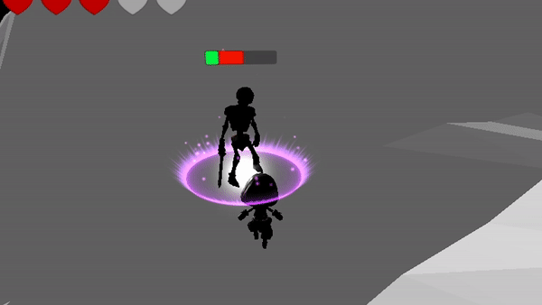
</p>

#### World Space—Prompts

Prompt canvas objects are attached to objects as a child, and disabled at the start. It is only enabled with GameObject.SetActive(true) when the player is within a certain distance. Once the player is away it is set to disabled again. The prompt is not looking at the camera, instead, it has the same rotation as the camera. 

### Global Options

An object called “Global Options” is used as saves. It is being updated only when the player is loading the next level,and fetched whenever a level is loaded. 
What happens within a level will not be saved or updated to this object. 
It currently saves two information:

-	player’s health
-	the quantity of items owned by the player

### BGM 
We attached Audio Manager Script to every background music, the way building it is like a Singleton Pattern that was taught in SWEN20003 before. We search the building in function, DontDestroyOnLoad(). And check if the next scene also has a BGM, if it has, destroyself and play the BGM, if not then remain self as the BGM in the current scene.


#### BossFight:

-	[Hollow Knight OST - Mantis Lords/Dung Defender](https://www.youtube.com/watch?v=IWZktANV-D8)
-	[Ori and the Blind Forest OST - 15 - Breaking Through the Trap](https://www.youtube.com/watch?v=yVCu9qp4yVc)
#### Climb:

-	[Music-The Thriller](https://www.youtube.com/watch?v=mb8S2Wlpojo)
#### Night:

-	[Ori and the Blind Forest OST - 14 - Gumos Hideout](https://www.youtube.com/watch?v=yVCu9qp4yVc)

#### Desert:

-	[Desert 澤野弘之](https://www.youtube.com/watch?v=IyxZAl4JDRg)
#### Countryside:

-	[Monument - TrackTribe](https://www.youtube.com/watch?v=L4Gb-SKJVbI)
#### Room1:

-	[Touch - Mattia Cupelli](https://www.youtube.com/watch?v=x-S9ggjcftw)
#### Snow:

-	[Snowy (Undertale OST)](https://www.youtube.com/watch?v=8BIeGdBjJiU)
#### Mainmenu:

-	[View of the Valley - Trevor Garrod](https://www.youtube.com/watch?v=-4SDqJsLg1Y)

### Sound Effect
In our game,  we have: 
Enemy damaged sound effect
Hero damaged sound effect
As both our enemy and hero has scripts called EnemyDamaged and PlayerDamaged, we just instantiate the audio clip whenever the script is triggered. The sound effect is adopted from Dark Souls III.

Hero shoot bullet sound effect
Our hero has a script called PlayerAttack, then instantiates the audio clip whenever the script is triggered. 

### Easter Egg 
You didn't read that wrong, we even hide easter eggs in the game. We've placed several chickens in the corners or in inconspicuous places in each scene. When the player finds these chickens it triggers a surprise! As for what the surprise is, it's an easter egg, find out for yourself! (A little bit of a spoiler, it's a lot like steam's achievement system） 
### Particle System 
We build our own particle system when our hero gets damaged (bleed).
As we want a burst effect bleeding we set the during 1 second and set the speed quite high, and adjust the emission arguments to make it more realistic, also we don’t want it to be the same at every frame, therefore we set the color over time to make it translucent at the end and also start lifetime random between 0.2 and 0.3.

<p align="center">
  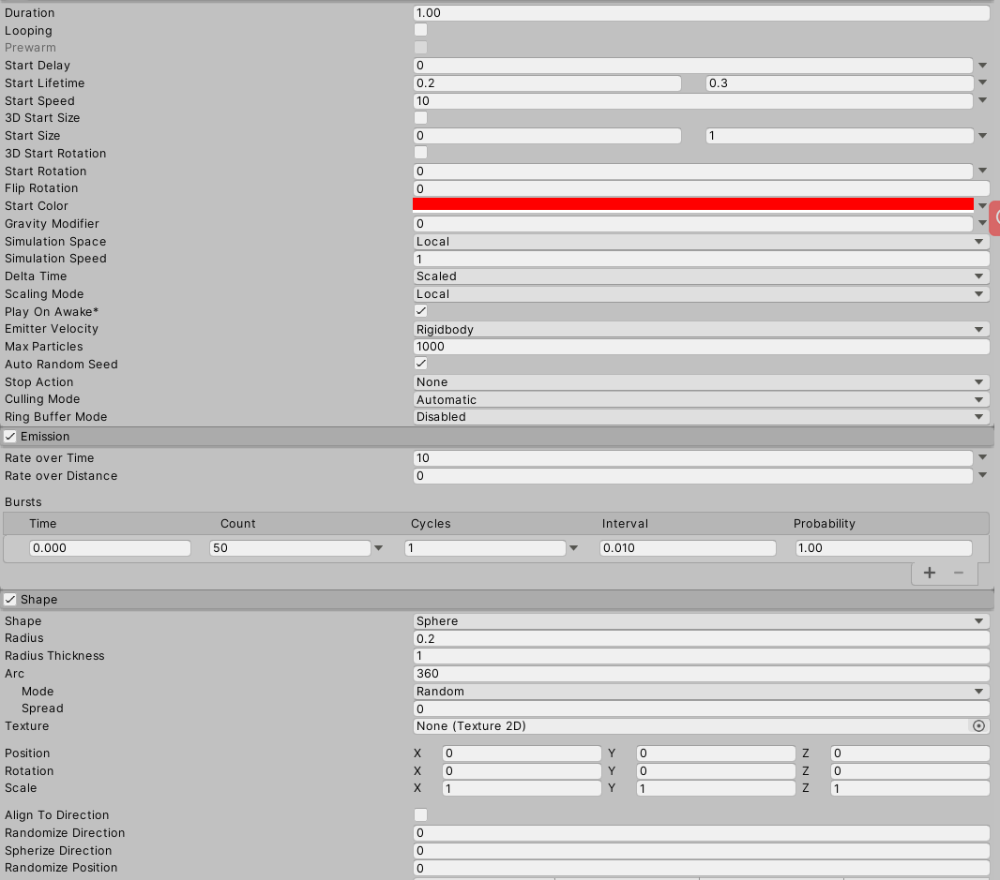
</p>

<p align="center">
  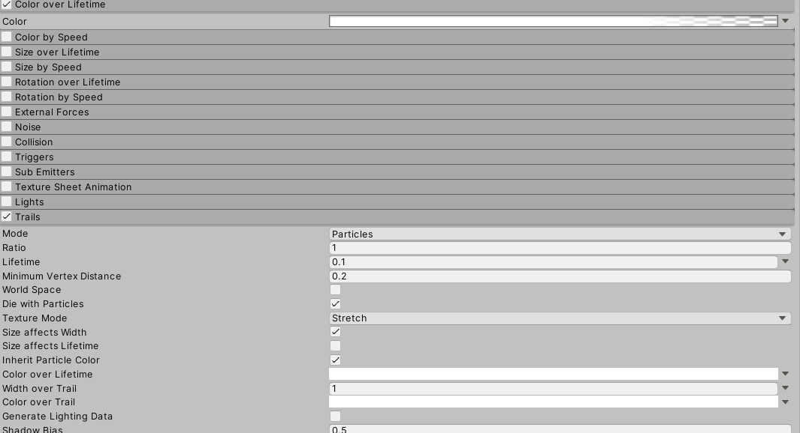
</p>

<p align="center">
  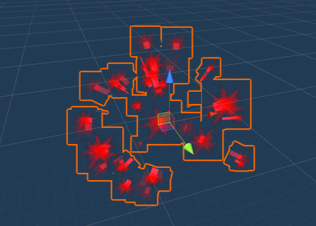
</p>

### How you Handle Camera Motion 

We created a third person perspective view. Firstly we added an empty gameobject to the Hero as a child, set the position to be Vector3(0.0f, 0.85f, 0.0f) so it is on the head of the hero. Then we put the camera into the target as a child. In this way, the camera will follow the hero wherever he goes. In the script, we rotate the camera at the same time rotating the player, both by using mouse positions. Lastly, the camera is set to lookAt the target each frame.

## How Shaders Works

### Sand Effect
We used a Geometry Shader when we defeated the bosses (uses Geometry Shader to achieve monster explosions and sanding effects). The Geometry Shader is often used to generate more new vertices and polygons to achieve the effects we expect, such as using it to generate grass bodies on the GPU for real-time rendering of real grass.

But Geometry Shader can not only generate new tuples, it can also reduce the output of vertices and polygons to achieve some interesting effects.

What we do is, within the Geometry Shader the input triangle element consisting of 3 vertices is modified to a point element consisting of only one vertex. The coordinates of the output point can simply be used as the center point of the triangle.

```c#
float3 tempPos = (IN[0].vertex + IN[1].vertex + IN[2].vertex) / 3;
    o.vertex = UnityObjectToClipPos(tempPos);

```
In this way, the grid that makes up the boss changes from triangular tuples to dot tuples and the number of vertices decreases, as well as the boss itself becomes the following.

<p align="center">
  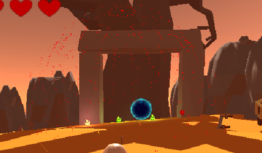
</p>


But at this time the model is stationary, so we can't see the effects of explosions or even grit. So the next step is to make the boss model move with time.

Therefore, we usd Physics formula, S = vt + 1/2at^2
```c#
	float _Speed;
	float _AccelerationValue;
	float _StartTime;

```

where S is the latest position of the vertex, the values of v0 and a can be passed into the shader as a uniform variable, the direction of motion can be along the normal of the triangle, and the source of t is the y component of Unity's built-in variable _Time.

```c#
	float3 v1 = IN[1].vertex - IN[0].vertex;
	float3 v2 = IN[2].vertex - IN[0].vertex;

	float3 norm = normalize(cross(v1, v2));

	float3 tempPos = (IN[0].vertex + IN[1].vertex + IN[2].vertex) / 3;

	float realTime = _Time.y - _StartTime;
	tempPos += norm * (_Speed * realTime + .5 * _AccelerationValue * pow(realTime, 2));

```

At the end we have the following effect:

<p align="center">
  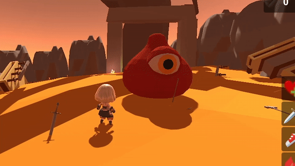
</p>

### Dreaming Effect
The second shader is to create a dreaming effect to fit our game name Layer Of Dreams. 
For each vertex, the shader finds its direction towards the centre of the camera screen. Then, apply the cross product to the direction vector and the vector3 (0.0f, 0.0f, 1.0f) which is the z axis. The cross product will return a Vector that is perpendicular to the direction vector and having z value of 0; After obtaining this direction, the vertex color will shear by a value in that direction.

```c#
	float2 dir;
	dir = i.uv - _ShearCentre.xy;
	float3 dirFinal = cross(float3(dir.x,dir.y,0.0f),float3(0.0f,0.0f,1.0f));
	dir = dirFinal.xy;


	float2 offset = _ShearValue * normalize(dir) ;

	// sample the texture
	float4 col = tex2D(_MainTex, i.uv + offset);

	return col;

```
If the shear value is 0, then the render image does not change at all. If it is positive, vertice’s colours will be sheared anti-clockwisely. Since the direction is found in the shader, it left us to script the change of value when the game is transitioning.

```c#
	void OnRenderImage(RenderTexture a, RenderTexture b){
		if (m!= null){
		    m.SetFloat("_ShearValue", ShearValue);
		    m.SetVector("_ShearCentre", ShearCentre);
		    Graphics.Blit(a,b,m);
		}else{
		    Graphics.Blit(a,b);
		}
	    }

```

This script is added to the main camera, so every Image rendered will be applied with the shader material.

```c#
   void Update()
    {   
        if(is_Dream==true){
            ShearValue = Mathf.Lerp(ShearValue,1.0f,Time.deltaTime);
        }
        //if(Input.GetKeyDown(KeyCode.T)){
          //  is_Dream=true;
        //}
    }

```
In the update(), we can just change the shearValue using lerp function, to make the transition animated and look like falling into a dream.

<p align="center">
  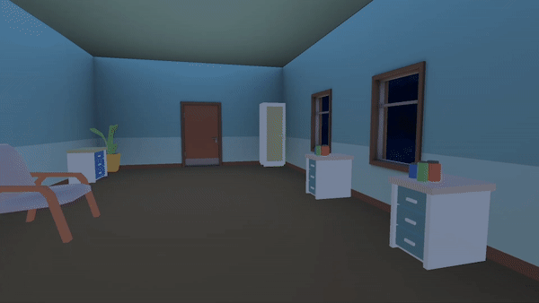
</p>

## Evaluation and Changes 

Each of us has reached out to several friends to evaluate our game. We have used a mix of different evaluation techniques, mainly due to the constraints of geographic locations and time differences.

-	Think Aloud Observational - 6 participants
-	Cooperative Observation- 5 participants
-	Interview - 2 participants
-	Questionnaire - 4 participants


We have received a lot of feedback on what we should improve on. These feedbacks are sometimes contradicting because participants have different preferences on what they want from a game—some of them like to explore the world, looking for details and pieces of a story, some of them like to challenge themselves to try speedrun or no-damage run. They focused on different aspects of the game, and have given valuable feedback about how we could improve our game.

It is surprising that most of the participants have rated 8 out of 10 when asked, with the acknowledgement that the game is developed in 1 month by 4 inexperienced programmers new to game development. 

We have made adjustments and improvements based on a selection of suggestions and feedback. It is impossible to listen to everyone’s advice because firstly, some of them are contradicting, and secondly, mainly due to time constraint. In this section, the suggestions and the improvements will be discussed.	


### UI
There are few grammar mistakes in the diary, and we have modified the text accordingly.

Most of the participants are stuck in the first room, because the instruction of pressing Tab is not clear. It is suggested that the instruction should be more direct. Thus, we have added a line on each diary, which says “Press tab to read diary again”, so that players are aware of how to do it. 

We also found out that players are running into problems because they do not read instructions, not even reading it when they are confused about the game objective. What they do is that they are being observant and figure out there is an enemy count, so they kill all enemies and figure out what to do next. When they are at the portal, they try multiple buttons to guess what the key binding is. So what we have done is to force the display of the instruction in the first level, so that at least they could have a glance, and maybe at least know what the objective is. We also added a prompt for the portal, so when the player is around it, it should hint that pressing T can load the next level.

It is both mentioned and exhibited that the effect of items are unclear, and that they could not figure it out with its icon only. Some of the participants are not aware that they could pick up items, because they do not look like something that could be picked up. In order to improve on this, we have added prompts to items, so that at least the name and icon of items will pop up when the player is around it, giving clear indication that it is an item to be picked up, and what effect it would probably have. The detailed description is in the instruction.

<p align="center">
  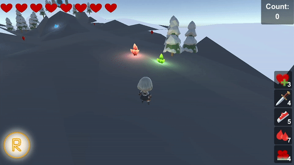
</p>

### Controls and Camera Perspective

The original camera perspective is fixed, looking at the character's back from a distance, as shown in the following image. But the obvious shortcoming is that it is not free-moving, causing problems when the participants have missed some enemies, and need to go backwards. They often get jumpscared by enemies that are outside of their view, and die ridiculously. This is a severe issue, so we have to fix it, change it to a typical third-person camera perspective. We ran into many bugs regarding player movements and camera controls, and we have to discard some of our fantastic damage feedback—camera shaking and short time pause. 

What has changed is the key bindings. Originally, with the fixed perspective, the movements of the character are binded to arrow keys, and A is binded to attack, meaning that players control the character movement with right hand, and attack with left hand. Every participant finds pressing A constantly is sore and tiring, because the left hand fingers are not “trained” for constant pressing of buttons. Arrow keys are more commonly seen in 2D games. It is just better to stick with WASD for movements. As we changed the camera perspective, we changed the key bindings as well—WASD for movement controls, and left mouse button for attack. Moreover, players are now able to press and hold down the left mouse button for shooting light bullets constantly.

### Mechanism and Difficulty

Regarding the difficulty and some mechanics of the game, there are a few things that the participants have brought up.
-	The game is not difficult to beat at all, so all items seem irrelevant, and play no role in the gameplay.
-	Players are not losing health at all, especially with so many recovery items, it is just unnecessary to recover all health for a player every single level. 
-	The item Power Within is constantly reducing health, so the consequent damage feedback is disturbing.
-	The super skill is not useful at all, it should be able to push the intimidating slime (suicidal bomb attacker) away from the player to prevent the explosion.
-	Falling off the edges of the map will cause the character to respawn at the start, with a penalty of losing 2 health. There are a few suggestions regarding this issue.
-	There is not an overall increase in difficulty levels as the game proceeds.

We have adopted the suggestions of saving the health of the character at the end of the level, and reward 2 health for completing a level, instead of recovering to full health. 

For the other issues, we have raised the level of difficulty of the game by varying the enemies attributes. As the game proceeds, the enemies are stronger, which is just an increase in attack frequency, damage they are dealing, and their search range. Spiders are now appearing in groups of three instead of one to make it more challenging.

A few participants dislike the mechanics that they will just lose health and respawn when they fall off an edge, because there is no warning at all. It is discouraging them to explore. In response to this feedback, we added invisible walls to stop players from walking into strange directions and falling off edges. But it is still possible for the player to die from walking off edges in some cases, such as falling off the edge in the parkour level, or walking into the water.

For the item Power Within, we have changed it to reduce 3 health immediately instead of reducing health continuously, so that damage feedback is not frequently affecting gameplay. 

For the super skill, we have increased the impact range so that it could be used as a protection mechanism against slimes. We have also changed the key binding from X to R so that the player can use it along with the WASD better.

### Maps

The participants have spotted a few bugs on the map, mainly with colliders and holes in the ground. We have fixed it already. 

The map of the parkour level has undergone some changes, because it was not that difficult to start with, and now with the free-moving camera, with dragons attacking while the player parkour, and the player should dodge the attack and proceed with the level. If the player loses all health, the player dies and restarts the level at the beginning.

<p align="center">
  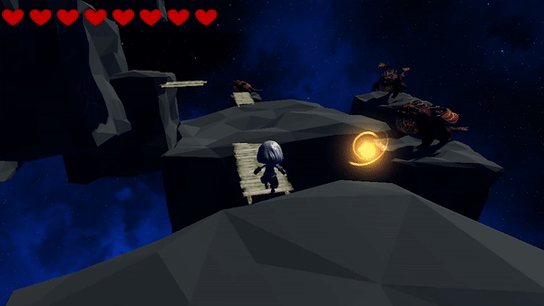
</p>

The slope in front of the Golem boss has caused many deaths because it is “slippery”, which is unreasonable. To make improvements on that, we have added stone stairs to help the player. 

In the third level (demo 2.2), the left side area is empty because we removed the flock of enemies, do not wish the player to be distracted and get lost about the destination. But based on the feedback, the participants seem confused about it. So we have decided to put some items around, and build a coop, filled with chickens, as an easter egg.

<p align="center">
  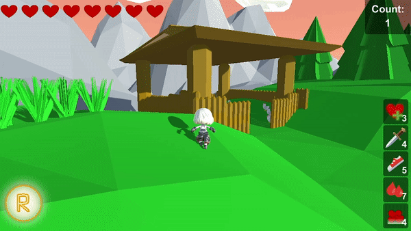
</p>

### What we disregard...

There is some feedback we listened and agreed to, but we did not make changes accordingly. These suggestions are as follows:
-	Plot is irrelevant to gameplay
-	There are not enough details/hints for plot
-	More rewards for exploration--when we first brainstormed the idea of this game, the main objective is to kill all enemies and proceed to the next level. Adding these rewards are not necessary for a complete gameplay experience. So we have decided we could spend more time on other improvements that improve the gameplay experience. We think the chicken easter eggs are enough.
-	Enemy and boss seems quite stupid and weak, because they seems blind, and have no AI
-	Slime should signal an upcoming explosion, reminding the player of keeping distance with the slime

## Code Attribution 
-	Crossfade transition between sence learned from https://www.youtube.com/watch?v=CE9VOZivb3I

-	PlayerDetectEnemy script learned from Unity API
https://docs.unity3d.com/ScriptReference/Vector3.Distance.html

-	Dreaming Effect learned and build on Miscellaneous-Shaders

-	Third person perspective learn from 
https://www.youtube.com/watch?v=4HpC--2iowE

-	Fuga spiders with destructible eggs and Mummy :https://assetstore.unity.com/packages/3d/characters/creatures/fuga-spiders-with-destructible-eggs-and-mummy-151921
-	Main Character: https://assetstore.unity.com/packages/3d/characters/sd-martial-arts-girl-xia-chan-102300#content 
-	Dragon the Soul Eater and Dragon Boar:
https://assetstore.unity.com/packages/3d/characters/creatures/dragon-the-soul-eater-and-dragon-boar-77121
-	Low Poly Dungeons Lite：
https://assetstore.unity.com/packages/3d/environments/dungeons/low-poly-dungeons-lite-177937
-	FREE Snowman：
https://assetstore.unity.com/packages/3d/props/free-snowman-105123
-	Modular Wooden Bridge Tiles：
https://assetstore.unity.com/packages/3d/props/exterior/modular-wooden-bridge-tiles-29501
-	RPG Poly Pack - Lite：
https://assetstore.unity.com/packages/3d/environments/landscapes/rpg-poly-pack-lite-148410
-	Translucent Crystals：
https://assetstore.unity.com/packages/3d/environments/fantasy/translucent-crystals-106274
-	Low Poly Tree Pack：
https://assetstore.unity.com/packages/3d/vegetation/trees/low-poly-tree-pack-57866
-	Low Poly Pack：
https://assetstore.unity.com/packages/3d/environments/low-poly-pack-94605
-	Snowy Low-Poly Trees：
https://assetstore.unity.com/packages/3d/vegetation/trees/snowy-low-poly-trees-76796
-	LowPoly Water:
https://assetstore.unity.com/packages/tools/particles-effects/lowpoly-water-107563
-	Fantasy RPG Cursor Pack:
https://assetstore.unity.com/packages/2d/gui/icons/fantasy-rpg-cursor-pack-87154

-	Medieval Weapons Pack [Melee]:
https://assetstore.unity.com/packages/3d/props/weapons/melee-weapons-pack-swords-axes-121237
-	Meshtint Free Chicken Mega Toon Series:
https://assetstore.unity.com/packages/3d/characters/animals/meshtint-free-chicken-mega-toon-series-151842
-	Mini Legion Rock Golem PBR HP Polyart:
https://assetstore.unity.com/packages/3d/characters/humanoids/fantasy/mini-legion-rock-golem-pbr-hp-polyart-94707
-	RPG Monster Duo PBR Polyart:
https://assetstore.unity.com/packages/3d/characters/creatures/rpg-monster-duo-pbr-polyart-157762
-	Fantasy Monster - Skeleton:
https://assetstore.unity.com/packages/3d/characters/humanoids/fantasy-monster-skeleton-35635
-	Low Poly Tree Pack:
https://assetstore.unity.com/packages/3d/vegetation/trees/low-poly-tree-pack-57866

-	Skybox Series Free
https://assetstore.unity.com/packages/2d/textures-materials/sky/skybox-series-free-103633

-	Epic Toon FX
https://assetstore.unity.com/packages/vfx/particles/epic-toon-fx-57772

-	Stylized Projectile Pack 1
https://assetstore.unity.com/packages/vfx/particles/stylized-projectile-pack-1-106979

-	All Sky
https://assetstore.unity.com/packages/2d/textures-materials/sky/allsky-200-sky-skybox-set-10109

-	Hospital lowpoly
https://assetstore.unity.com/packages/3d/environments/urban/hospital-lowpoly-82552


-	how to compare strings from there: https://docs.microsoft.com/en-us/dotnet/api/system.string.compareto?view=netcore-3.1

-	how to write list remove operation with lambda expression from here:
https://stackoverflow.com/a/3069663/14397665 

-	how to use DrawTexture() from this link, and the player health bar is heavily based on this approach:
https://answers.unity.com/questions/1254100/add-image-dynamically-in-runtime.html 

-	a few things from this link:
How to change UI text content
Basics of UI, especially anchor points
https://www.youtube.com/watch?v=_RIsfVOqTaE 

-	how to manipulate slider’s fill amount value with script, and GameObject.SetActive() function from this link:
https://www.youtube.com/watch?v=ZYeXmze5gxg 

-	how to use foreach() to get children of an object in this link:
https://answers.unity.com/questions/205391/how-to-get-list-of-child-game-objects.html

-	Most of the icons of the items and buffs origins from emoji, which is from this link: 
https://emojipedia.org/ 

-	how to write GameEvents as singleton
https://www.youtube.com/watch?v=gx0Lt4tCDE0 

-	Player Animation Controller Script and player’s animator is adopted from the asset itself. 

-	how to passing functions as parameters from this link:
https://www.tutorialsteacher.com/csharp/csharp-delegates 

-	how to do DontDestroyOnLoad objects from teammates Yuhao Zong.

-	Our group has learnt how to make animation controllers from this link, and make animation controllers for all enemies ourselves.
https://www.youtube.com/watch?v=JeZkctmoBPw 

### Font:

-	Credits, titles, death prompt, text on buttons on instructions, captions in video: http://www.fonts.net.cn/font-38362147245.html 

-	For (old) super icon, used in video:
https://izihun.com/shangyongziti/481.html 

-	For new super icon:
https://www.fontspace.com/charlatan-demo-font-f25048 

## Contribution
* Ken Lin(Ken)
* Yannan Li(Lyn)
* Yuhao Zong(Hatch)
* Weng Kuan Kwok(Tina)

| Name | Task | State | Last Updated Date |
| :---              | :---                                       |  :---:  |   ---: |
| All Members       | Basics (First Scene)                       |  Done   | 27 Sep |
| All Members       | Basics (Prototype Player Controller)       |  Done   | 27 Sep |
| All Members       | Basics (Prototype Health System)           |  Done   | 27 Sep |
| All Members       | Basics (Prototype Shooting Mechanics)      |  Done   | 27 Sep |
| Ken Lin           | Enemy Lock On                              |  Done   | 28 Sep |
| Yuhao Zong        | Enemy Detection and Selection              |  Done   | 29 Sep |
| Yuhao Zong        | Player Shooting Mechanics                  |  Done   | 29 Sep |
| Weng Kuan Kwok    | MainCharAsset and AnimationControl         |  Done   | 30 Sep |
| All Members       | (Some) Enemy Animator (State Machine)      |  Done   |  5 Oct |
| All Members       | Enemy Melee Ranged Attack Scripts          |  Done   |  6 Oct |
| Weng Kuan Kwok    | MainChar Rotation                          |  Done   |  7 Oct |
| Ken Lin           | Enemy Rotation                             |  Done   |  7 Oct |
| Weng Kuan Kwok    | Health UI for Player                       |  Done   |  7 Oct |
| All Members       | Enemy Suicide Attack scripts               |  Done   |  8 Oct |
| All Members       | Enemy Animation (Some)                     |  Done   |  8 Oct |
| Yuhao Zong        | Basics (Explosion Particle Systems)        |  Done   |  9 Oct |
| Yuhao Zong        | MainChar Rotation Bug Fix                  |  Done   | 10 Oct |
| Yannan Li         | Vertex Shaders for Water                   |  Done   | 10 Oct |
| All Members       | Basics (Buff Item System Prototype)        |  Done   | 11 Oct |
| All Members       | Basics (Add Some Death Condition)          |  Done   | 11 Oct |
| Weng Kuan Kwok    | Player - Adapt Composite Design Pattern    |  Done   | 11 Oct |
| Weng Kuan Kwok    | Enemy - Adapt Composite Design Pattern     |  Done   | 11 Oct |
| Ken Lin           | Enemy - Dragon Animators                   |  Done   | 11 Oct |
| Weng Kuan Kwok    | Minor Changes: Projectiles - Do Triggers   |  Done   | 11 Oct |
| Weng Kuan Kwok    | Minor Changes: Player Health System        |  Done   | 11 Oct |
| Weng Kuan Kwok    | Minor Changes: Dev Display UI              |  Done   | 11 Oct |
| Yuhao Zong        | Implement Particle System for Enemy        |  Done   | 11 Oct |
| Yuhao Zong        | Implement Particle System for Projectile   |  Done   | 11 Oct |
| Ken Lin           | Animator Bug Fix                           |  Done   | 11 Oct |
| Yannan Li         | Level and Environment Visual Assets        |  Done   | 11 Oct |
| Yannan Li         | Shaders                                    |  Done   | 11 Oct |
| Yannan Li         | Map 2.0 					 |  Done   | 16 Oct |
| Yannan Li         | Map 2.1				         |  Done   | 16 Oct |
| Yannan Li         | Map 2.2 				         |  Done   | 16 Oct |
| Yannan Li         | Map 4.0                                    |  Done   | 16 Oct |
| Yannan Li         | Map 4.1 	                                 |  Done   | 16 Oct |
| Yannan Li         | Map 4.2 	                                 |  Done   | 16 Oct |
| Yannan Li         | Map 4.3 	                                 |  Done   | 16 Oct |
| Yannan Li         | Map climb		                         |  Done   | 16 Oct |
| All Members       | Portal implementation                      |  Done   | 18 Oct |
| All Members       | Stone Boss (Golem) Implementation          |  Done   | 18 Oct |
| Weng Kuan Kwok    | Buff CoolDown UI                           |  Done   | 19 Oct |
| Weng Kuan Kwok    | Basics (Skill Cool Dow UI)                 |  Done   | 19 Oct |
| Weng Kuan Kwok    | Enemy Health Bar	                         |  Done   | 19 Oct |
| Weng Kuan Kwok    | Boss Special Health Bar                    |  Done   | 19 Oct |
| Weng Kuan Kwok    | Collate All Folders                        |  Done   | 19 Oct |
| Weng Kuan Kwok    | Adjust Sence Objects                       |  Done   | 19 Oct |
| Yuhao Zong        | Implement New Particle System              |  Done   | 19 Oct |
| Yuhao Zong        | Implement TimePause Effect                 |  Done   | 19 Oct |
| Ken Lin           | Stone Boss Animator                        |  Done   | 22 Oct |
| Yuhao Zong        | Adjust Light Setting (higher contrast)     |  Done   | 23 Oct |
| Ken Lin           | Slime Boss Implementation                  |  Done   | 23 Oct |
| Yannan Li         | Map 5.1 					 |  Done   | 23 Oct |
| Yannan Li         | Map 5.3				         |  Done   | 23 Oct |
| Yannan Li         | Map 5.4				         |  Done   | 23 Oct |
| Yuhao Zong        | Room 1-6                                   |  Done   | 23 Oct |
| Weng Kuan Kwok    | Enemy Count Display UI                     |  Done   | 23 Oct |
| Weng Kuan Kwok    | Super Skill UI                             |  Done   | 23 Oct |
| Ken Lin           | Transition Distortion Shader               |  Done   | 24 Oct |
| Yuhao Zong        | Backbround Musics for All Levels           |  Done   | 27 Oct |
| Ken and Hatch     | Level Transition                           |  Done   | 28 Oct |
| Ken and Weng Kuan | Main Menu UI                               |  Done   | 29 Oct |
| Weng Kuan Kwok    | Boss Health Bar Fix                        |  Done   | 29 Oct |
| Weng Kuan Kwok    | Respawn When Death (With Transition)       |  Done   | 29 Oct |
| Yuhao Zong        | Sound Effects                              |  Done   | 29 Oct |
| Yuhao Zong        | Backbround Musics for All Levels           |  Done   | 29 Oct |
| Ken and Yuhao     | Spider Boss                                |  Done   | 29 Oct |
| Weng Kuan Kwok    | Buff Item System Logics                    |  Done   | 29 Oct |
| Yannan Li         | Fix Map bugs			         |  Done   | 31 Oct |
| Yuhao Zong        | Fix Enemy bugs			         |  Done   | 31 Oct |
| Ken Lin           | Fix Camera bugs			         |  Done   | 31 Oct |
| Weng Kuan Kwok    | Fix UI bugs                                |  Done   | 31 Oct |
| Weng Kuan Kwok    | Item Prompt UI                             |  Done   |  3 Nov |
| Weng Kuan Kwok    | Spider Debuff Attack Logic                 |  Done   |  3 Nov |
| Ken Lin           | New Camera Controller (free 3rd person)    |  Done   |  3 Nov |
| Yannan Li         | Chicken Coop				 |  Done   |  3 Nov |
| Weng Kuan Kwok    | Spider Boss Debuff Attack                  |  Done   |  4 Nov |
| Yuhao Zong        | Boss Sand Effect Shader                    |  Done   |  4 Nov |

## Our Reflections

### Yannan Li:
This is the most time and effort I've ever spent on an assignment and the most rewarding I've ever done. The finished product of this assignment has far exceeded my expectations. We encountered many difficulties and never before learned content in this assignment, but we eventually solved them. 

I was in charge of the design and construction of the scenes in the group. The trouble I had was the need to create different scenes with the same elements. I had to think about how to differentiate each scene and also add details to the scene to make it look as realistic as possible. The biggest problem was that I needed to guide the player through the entire scene to the end position. I tried to use trees, trestles, lights, and the location of enemies to guide the player. Thankfully, this attempt seems to have been quite successful so far.
I think it was a great success and it gave us a lot of freedom. 

I also have to thank my group members, no one showed impatience during the often long sessions and everyone did their job well. It was one of the most enjoyable collaborative assignments I've ever had.


### Ken Lin:
It has been a long period of time since we started the project, and I have really learnt a lot throughout the project. At the start, I thought everything was simple as you put the objects in ,write scripts and it will just work. However, when we actually implemented it, it was all different. We wanted a quality game, so we decided to try the animation even though it isn't worth a mark. Also, ideas flash out from our mind while we are implementing features, of course we can not pick them all, but we have tried our best to make our game like a game, not an assignment. Thanks to COMP30019, project 2 provides such a freedom that we could make our own game, and I believe we all get an idea how to make a game by making it.

### Weng Kuan Kwok:

I am really glad that I got the opportunity to work with my teammates on this project! They are enthusiastic, inspirational, creative and hard-working programmers, and I love working with them!

We have worked so hard for the month. We are all excited about and keen to learn about game development, and we definitely threw ourselves at this project. At the beginning of the project, we have listed so many things that seemed somewhat daunting, it is quite a huge list, and we have no idea how to start at all. Finally, we have come to the end of the project. Looking back on what we have achieved, I feel content, blessed and accomplished. 

I could still remember that we have written many logics and scripts together for both enemy and players, but lacking design and organisation, because we are simply trying things out. It is so buggy and error-prone that even the slightest changes or addition of new things would totally break the logic. We are so frustrated, and disappointed. But we did not give in and stopped there. We worked around it. There are so many days when we simply stay awake and keep working on the project for the night, because we do not want any regrets. 

I think we did it. We have worked so hard on it. We have learnt so much, overcoming so many challenges together as a team. This project has definitely bonded us together as friends, who are like-minded, with same interests and motivations. I cannot express enough gratitude to my teammates, who are always supportive and enthusiastic. 

I have learnt a lot doing this project. I am now much more familiar with Unity, able to write C#, have a much better understanding about prefabs, composite design patterns and event-driven programming. I have also learnt a lot about UIs and UI designs, even though I am still struggling with screen fitting. I have learnt so much that I simply cannot conclude them in a single paragraph. I am thankful for this opportunity, and I am sure what I have learnt in this project will be remarkable and useful in the future. 

The only regret is that I have suggested that we should do a fixed camera perspective at a start, and after the evaluation we are in such a hurry to make modifications and achieve a freely moving third person camera perspective. We ran into so many bugs. I am so sad that we do not have time to debug the camera shake and time stop for damage feedback after the implementation. I genuinely loved that strong feedback. I do not think my teammates would blame me about it, but I felt so sorry. 

Finally we reached the end. I am beyond words. I am proud of what we have achieved. Thank all my teammates for being hardworking, supportive and tolerant throughout the harsh challenging month. Thank myself for taking this subject, and have this wonderful remarkable experience! Wish us all the best!

### Yuhao Zong:

The game that took more than a month to develop is finally finished today! From the beginning of our ignorance, we gradually learn all kinds of things, such as how to write shaders, how to do animation, how to do particle effects, how to add music, how to manage files to facilitate our use, how to change the skybox and so on and so forth, we have learned so much along the way.

This course gave us a chance to create our own game, we just took it as a subject assignment at the beginning and wanted to finish it, but the more we did, the more motivated we were, and the more we took it as our game to create and perfect, and put more time and energy into it.

Thank you COMP30019 for giving me this opportunity!

Because I'm an early sleeper, my family and friends during the making of this game often asked me why I always stayed up late at night into the wee hours of the morning, asking why I'd never stayed up so late for a coursework assignment before. I asked myself if it was worth staying up so late for this assignment. The answer is 100 percent worth it! Every time a feature is refined or a new particle effect is added or a new BGM is added, they all excite and delight me!

But there were some disappointments in the making of this game. For example, I made my own script for timeStop and cameraShake to create the effect of being hit. But it was deleted at the end for some reason. That's probably a give and take!

It'll happen in the future too, I guess.

I'm really grateful to my team members who never showed up late or complained about the online discussions which we have three or even four times a week. We finished the game with the best of intentions, and it was not just an assignment for us, but a game that we put our heart and soul into!

Thank you to my fellow panelists.


